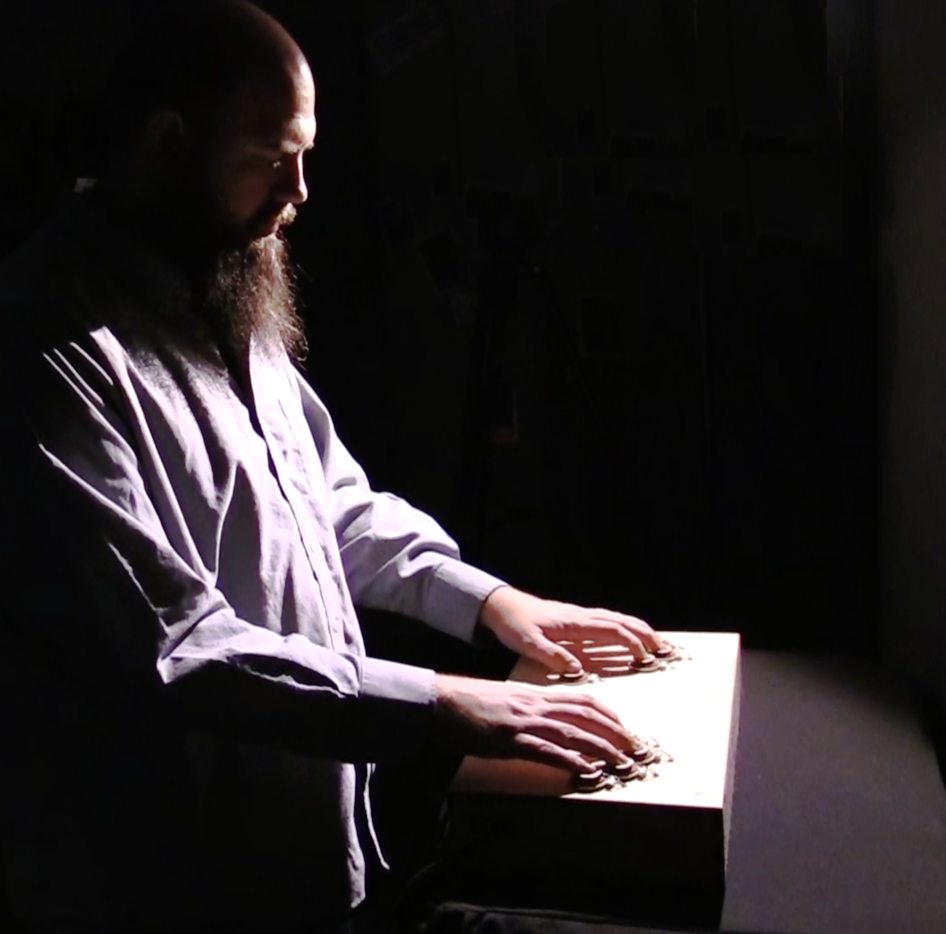

## About  

 

Chase Mitchusson is a composer and PhD candidate in Experimental Music & Digital Media at Louisiana State University. His works are primarily electronic, which blend synthesis and signal processing with his own field recordings. Much of his influence comes from video games, Japanese culture, hip hop, nature, and textural audio and images. His orchestra piece and chamber works are driven by acoustic implementation of electronic instrument behaviors that explore texture and timbre. Recently, his focus has been on game audio, web audio, and embedded instruments.  
